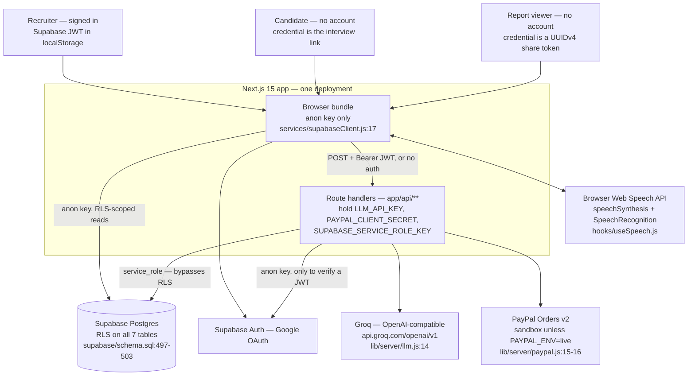
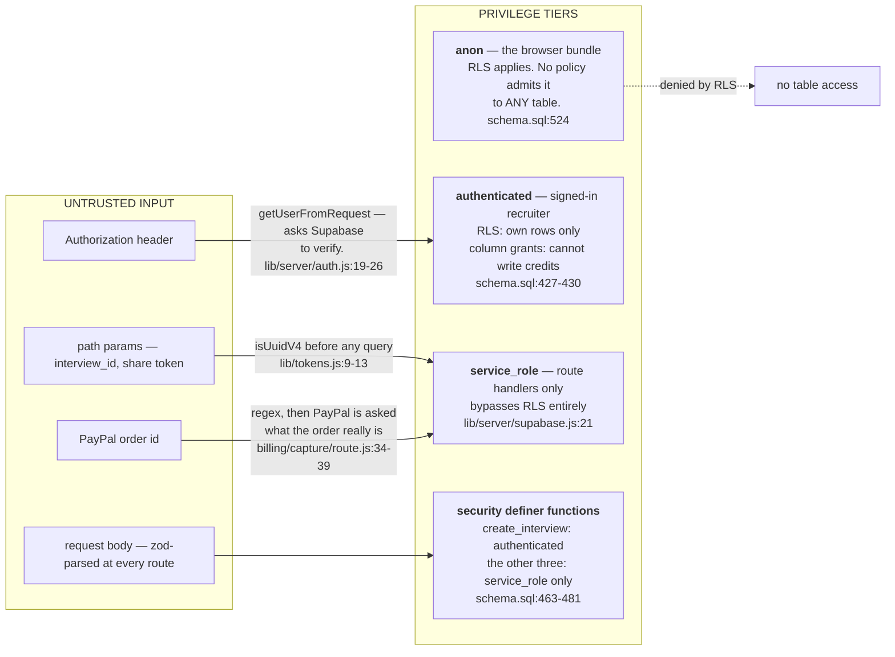
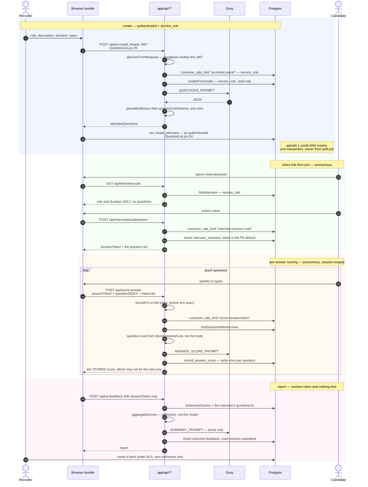
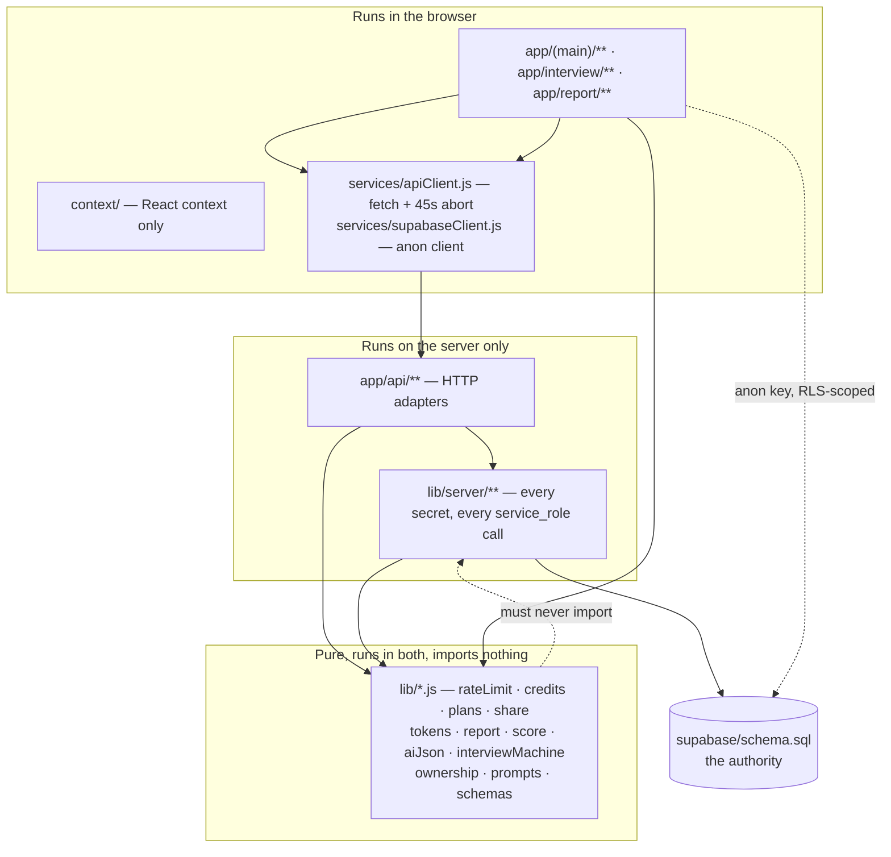
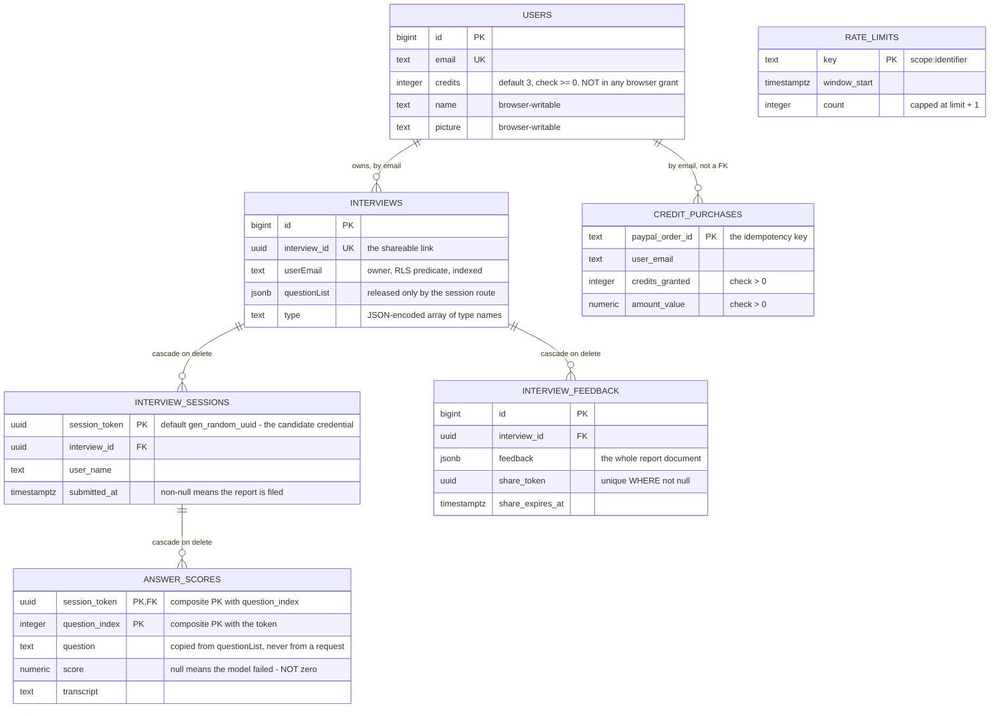

# Architecture

This system has three kinds of caller — a signed-in recruiter, an anonymous
candidate holding a link, and a colleague holding a report link — and three
different database keys. Almost every structural decision in the codebase is an
answer to "which of those is making this request, and what is the least it needs
to be given?"

So this document is organised by privilege rather than by folder. Every claim
cites the file and line it came from. Where a design raises a "why", it links to
[DECISIONS.md](./DECISIONS.md) rather than restating it.

---

## 1. The three callers and the three keys



There is no separate backend, no queue, no cache, no object store and no
telemetry service. An Express backend existed and was deleted (DECISIONS.md,
"The Express backend was deleted"). The candidate's voice loop runs entirely in
their own browser — there is no speech vendor and no key for one
(`hooks/useSpeech.js`, DECISIONS.md "The browser's Web Speech API…").

---

## 2. The privilege map

This is the section to read first. Five distinct privilege levels touch the
data, and the difference between them is enforced by Postgres, not by
JavaScript.



**What each tier can actually do:**

| Tier | Reaches the database how | Can read | Can write |
| --- | --- | --- | --- |
| `anon` | browser, `NEXT_PUBLIC_SUPABASE_ANON_KEY` (`services/supabaseClient.js:17`) | nothing — RLS is on for all seven tables and no policy names `anon` (`supabase/schema.sql:497-503`, `523-525`) | nothing |
| `authenticated` | browser, same key + the user's JWT | own `Users` row, own `Interviews`, feedback for own interviews (`schema.sql:508-561`) | `Users.name`/`picture` only; `Interviews` update/delete only (`schema.sql:427-436`) |
| `service_role` | route handlers, `SUPABASE_SERVICE_ROLE_KEY` (`lib/server/supabase.js:21-30`) | everything — RLS is bypassed | everything |
| `create_interview()` | called by the browser as `authenticated` (`QuestionList.jsx:54`) | — | spends a credit + inserts the interview, owner taken from `auth.jwt()->>'email'`, never from an argument (`schema.sql:233`) |
| `grant_purchased_credits()`, `record_answer_score()`, `consume_rate_limit()` | `service_role` only; execute is revoked from `public, anon, authenticated` (`schema.sql:463-481`) | — | the credit balance, the score rows, the limiter |

**The one non-obvious rule in that table**, and the reason the schema comments
labour it: *row level security decides which rows, never which columns*
(`supabase/schema.sql:410-423`). The policy `users update own profile`
(`schema.sql:517-521`) is perfectly satisfied by

```js
supabase.from("Users").update({ credits: 999999 }).eq("email", myEmail)
```

because the row genuinely is the caller's. Only the column-level grant at
`schema.sql:430` — which lists `name` and `picture` and not `credits` — closes
it. And because a column-level `REVOKE` does not override a table-wide
privilege, each table grant is revoked first and re-granted per column
(`schema.sql:421-422`).

**Where untrusted input is stopped:**

- Every route body is parsed by a zod schema before anything else runs
  (`ai-model/route.js:26-31`, `score-answer/route.js:36-41`,
  `ai-feedback/route.js:43-45`, `session/route.js:28-31`,
  `feedback/share/route.js:20-23`, `billing/capture/route.js:34-39`).
- Tokens handed to people with no account are shape-checked before they become
  a query at all (`lib/tokens.js:9-13`, called at `score-answer/route.js:55`,
  `ai-feedback/route.js:66`, `lib/server/reports.js:88`).
- Identity is never read from a body. The recruiter's email comes from the
  verified JWT (`lib/server/auth.js:23-25`); the candidate's name comes from the
  session row created when they joined (`ai-feedback/route.js:148`); the
  interview's owner comes from `auth.jwt()` inside the SQL function
  (`schema.sql:233`).
- The scoring prompt takes a question **index**, not question text
  (`score-answer/route.js:38-39`), and the question is read out of the stored
  `questionList` (`score-answer/route.js:93-101`). `fillTemplate` is plain
  substitution with no escaping, so caller-supplied question text was a prompt
  injection into the project's model budget — the index is the whole of that fix
  (`score-answer/route.js:4-12`).
- Money facts come from PayPal, never from the browser. The client sends an
  order id; `captureOrder` asks PayPal what the order is, and
  `resolveGrant` decides from status, purchase-unit count, capture count,
  currency and captured amount (`lib/server/paypal.js:39-58`,
  `lib/credits.js:22-58`).

**What deliberately crosses back out:** `jsonError` returns a short message and
a real status code (`lib/server/http.js:9-11`); route handlers log the detail
with `console.error` and return a generic sentence. A shared report is returned
with `Cache-Control: private, no-store` (`report/[token]/route.js:33`) and
without any email address (`lib/server/reports.js:110-118`).

**A gap that is real and is named in the README:** there is no server-side route
guard. `/dashboard` renders its shell before the client-side session check
resolves, because the Supabase session lives in `localStorage` where Next.js
middleware cannot see it. Nothing leaks — every read is RLS-scoped — but the URL
is not blocked. The RLS layer is load-bearing for that, which is why
`scripts/verify-live-schema.mjs` exists: 49 read-only checks that the live
project actually has the policies this repository assumes.

---

## 3. One interview, end to end

Annotated with the key in use at each hop, because that is the part that is
invisible in the code.



The step-to-file map:

| Step | File |
| --- | --- |
| generate questions | `app/api/ai-model/route.js:36-127` |
| create the interview atomically | `app/(main)/dashboard/create-interview/_components/QuestionList.jsx:54-66` → `supabase/schema.sql:219-263` |
| join screen data | `app/api/interview/[interview_id]/route.js:20-42` |
| session mint + question release | `app/api/interview/[interview_id]/session/route.js:33-101` |
| the live session state machine | `lib/interviewMachine.js:65-167`, driven by `app/interview/[interview_id]/start/_components/InterviewSession.jsx:62-78` |
| score one answer | `app/api/score-answer/route.js:46-179` |
| record it write-once | `supabase/schema.sql:340-389` |
| build the report | `app/api/ai-feedback/route.js:58-158`, `lib/report.js:43-68`, `lib/score.js` |
| share it | `app/api/feedback/share/route.js:25-57`, `lib/server/reports.js:49-75` |
| read a shared report | `app/api/report/[token]/route.js:15-43`, `lib/server/reports.js:87-119` |

Two orderings in that flow are the load-bearing ones:

- **The questions are released by the session route, not the GET route.** They
  used to be in the join-screen payload, so anyone with a link could `curl` the
  questions and prepare against them — invisible in the UI, which only ever
  displayed the job title (`app/api/interview/[interview_id]/route.js:8-12`).
- **The score is written when it is issued, not sent back at the end.** The
  final request carries a session token and nothing else
  (`ai-feedback/route.js:43-45`), so there is no number in it that a candidate
  could have chosen. `lib/report.js:1-14` states the reasoning bluntly:
  determinism is not provenance.

---

## 4. Where the code lives



| Layer | Owns | May not touch |
| --- | --- | --- |
| `lib/*.js` (flat) | pure rules: rate-limit arithmetic, plan pricing, grant eligibility, token shape, report assembly, the session reducer | `process.env`, any client, any `fetch`. Every file here is unit-tested with no network and no database (`tests/*.test.js`, run by `node --test`). |
| `lib/server/*.js` | every secret and every privileged call. `serverAdminClient()` is only constructed here | HTTP concerns — none of these take a `Request` except `auth.js`, which reads one header |
| `app/api/**/route.js` | parse, authorise, rate-limit, call, map errors to status codes | business rules and SQL. The clearest example is `billing/capture/route.js`, which is an adapter over `processCreditPurchase` |
| `services/*.js` | the browser's two ways out: `fetch` with a timeout, and the anon Supabase client | secrets |
| `supabase/schema.sql` | atomicity, privilege, ownership | — |

**Enforced vs. conventional.** The layering here is enforced by *three* real
mechanisms and conventional everywhere else:

1. **The `NEXT_PUBLIC_` prefix is the actual boundary.** Next.js inlines only
   prefixed variables into the browser bundle. `SUPABASE_SERVICE_ROLE_KEY`,
   `LLM_API_KEY` and `PAYPAL_CLIENT_SECRET` have no prefix, so importing
   `lib/server/supabase.js` into a client component does not leak the key — it
   fails, because the value is `undefined` and `requireEnv` throws
   (`lib/server/env.js:10-13`).
2. **Postgres refuses.** A client component that tried to call
   `record_answer_score` gets a permission error, because execute is revoked
   from `anon` and `authenticated` (`schema.sql:478-481`). The boundary does not
   depend on anyone respecting the folder name.
3. **`lib/*.js` purity is enforced by the test runner.** These tests are plain
   `node --test` with no mocking framework and no environment; a file that
   reached for `process.env` or a network client would not run there.

What is *not* enforced: nothing stops a new route handler from doing its own
`createClient(...)` with the service-role key instead of going through
`lib/server/supabase.js`, and nothing stops a client component importing
`lib/server/reports.js` and getting a confusing runtime error instead of a
compile-time one.

---

## 5. The schema



(`INTERVIEW_FEEDBACK` is the real table `public."interview-feedback"`; the
hyphen is not a legal mermaid identifier.)

Five constraints in there are doing real work and are easy to mistake for
decoration:

**`credit_purchases.paypal_order_id` is the primary key.** Not a unique index on
a surrogate row, not an application-level "have we seen this?" check — the
PayPal order id *is* the key, so granting is idempotent by construction. A
replayed capture request loses the insert race and adds nothing
(`schema.sql:74-86`, `schema.sql:295-307`). An application check would be
straddled by two concurrent requests; a primary key cannot be.

**`answer_scores` has a composite primary key `(session_token, question_index)`,
and `record_answer_score` updates only `where a.score is null`**
(`schema.sql:130`, `schema.sql:375`). That is what makes a score write-once: a
candidate cannot resubmit the same answer until the model happens to return a
ten, because the second write matches no row and the function returns the score
that *is* stored (`schema.sql:378-387`, surfaced at `score-answer/route.js:167-177`).
The single exception — a null score — exists so a retry after a scoring outage
still works.

**`answer_scores.score` is nullable on purpose.** A scoring outage is recorded as
"could not be scored", never as a zero (`schema.sql:123-125`), and
`score-answer/route.js:128-145` writes the transcript unscored rather than
losing the candidate's work.

**`interview_feedback_share_token_idx` is unique *and partial***
(`schema.sql:146-150`). Unique so a token resolves to at most one report; partial
so the thousands of never-shared rows do not compete for it.

**`users_credits_non_negative` is added `NOT VALID`** (`schema.sql:397-406`) so
the file can be applied to a project whose tables already exist: the rule binds
every future write without failing on historic rows.

---

## 6. Atomicity — four decisions Postgres makes because JavaScript cannot

Each of these was a read-then-write in application code, and each was a real
bug. The pattern is the same every time: put the decision *inside* the statement.

### 6.1 The rate limiter — `INSERT … ON CONFLICT DO UPDATE … RETURNING`

`supabase/schema.sql:171-207`.

The old shape read the counter, decided in JavaScript, then wrote it back. Two
requests arriving together both read the same count and both were admitted, so a
limit of 20 passed 21 or more under exactly the load a limiter exists for. The
upsert takes a row lock, so concurrent callers are serialised by the database.

Two details worth keeping: the count is capped at `limit + 1`
(`schema.sql:197`), which keeps the stored value bounded under a sustained flood
*and* makes "allowed" decidable from the returned row alone; and
`lib/rateLimit.js:49-75` is a pure reference model of the same rule that
`tests/sql.test.js` runs side by side with the SQL over the same call sequence,
so the rule stays readable in JavaScript while Postgres remains the thing that
enforces it.

### 6.2 Spending a credit — the guard is in the `WHERE` clause

`supabase/schema.sql:219-263`.

```sql
update public."Users" set credits = credits - 1
 where email = v_email and credits > 0
returning credits into v_remaining;
if not found then raise exception 'no interview credits remaining' ...
```

Two concurrent calls cannot both see the last credit: the second matches no row.
And the insert is in the same function body, so it is the same transaction —
previously a browser-side `INSERT` followed by a separate `credits - 1` `UPDATE`
whose failure was logged and ignored, which meant a failed insert still charged
a credit and a recruiter who never sent the second request was never charged at
all (`QuestionList.jsx:47-53`).

### 6.3 Granting purchased credits — idempotent on a primary key

`supabase/schema.sql:274-326`. The ledger insert comes first and carries the key;
`v_granted` is `exists(select 1 from inserted)`, and the balance moves only when
that is true. `lib/server/credits.js:34-69` layers a cheap `findPurchase` in
front of it for the common double-click, and the comment at line 35-37 is
explicit that this is the optimisation and not the guarantee — two simultaneous
first attempts both find nothing there and are separated by the primary key.

PayPal is made idempotent separately, by sending the order id as
`PayPal-Request-Id` and by treating a `422 ORDER_ALREADY_CAPTURED` as "read the
order back" rather than as a failure (`lib/server/paypal.js:138-161`). The
comment at `paypal.js:129-131` states why both exist: the database guarantee must
not depend on a vendor.

### 6.4 Recording a score — conditional update, not read-then-write

`supabase/schema.sql:340-389`, covered in §5. `lib/server/sessions.js:70-78`
names the race it prevents: a check in JavaScript would be straddled by two
concurrent submissions of the same answer.

---

## 7. Failure modes

| Dependency / event | What actually happens | Where |
| --- | --- | --- |
| **Missing env at boot** | Production **refuses to start**. Development prints the same named list and starts anyway, so the UI can be toured with placeholder values. | `lib/server/config.js:111-121`, `instrumentation.js:14-20` |
| **Billing half-configured** | Treated as missing, not as configured: a client id with no secret gives the user a PayPal window and a server that cannot verify what they paid. All three or none. | `lib/server/config.js:39-54,65-75` |
| **Groq down or slow** | 30s timeout, `maxRetries: 1` in the client. On question generation → 502 and nothing is charged. On scoring → the transcript is written unscored and the candidate gets 502 for that answer, the interview continues. On the summary → the report is still produced with `summaryGenerated: false` and a fixed explanatory paragraph. | `lib/server/llm.js:20,43-44`; `score-answer/route.js:128-146`; `ai-feedback/route.js:50-56,116-129` |
| **Groq returns unparseable or invalid JSON** | One corrective retry with the rejection reason fed back, then `StructuredOutputError`. Never a partially-validated object. | `lib/server/llm.js:57-96`, `lib/aiJson.js:39-49` |
| **The limiter itself is unavailable** (missing service key, RPC error) | **Fails closed** — every rate-limited route returns 503 rather than running unmetered. An unmetered LLM endpoint open to the internet is the failure this exists to prevent. | `lib/server/rateLimit.js:14-18,38-41`; e.g. `ai-model/route.js:58-67` |
| **Credit balance unreadable** | 503, not "assume they have some". `canSpendCredit(null)` is false by construction. | `ai-model/route.js:83-88`, `lib/credits.js:68-70` |
| **PayPal 404 on an order** | 404 "PayPal does not recognise that payment" — which is also what a live order id looks like when `PAYPAL_ENV` is sandbox, so the environment mistake fails safe. | `billing/capture/route.js:96-98`, `lib/server/paypal.js:8-11` |
| **PayPal reachable but refuses the capture** | 502, no credits, nothing written. | `billing/capture/route.js:94-99` |
| **Replayed capture of someone else's order id** | 403 `notYours`. The replayer learns nothing and gets nothing; the credits stay with whoever the order was captured for. | `lib/server/credits.js:71-88` |
| **Supabase unreachable mid-request** | The thrown error is caught by the route's outer `try` and mapped to 500 with a generic sentence; the detail goes to `console.error`. There is no retry and no backoff anywhere. | e.g. `session/route.js:94-101` |
| **Report row missing / not yours** | Both answered identically as 404, so the endpoint cannot be used to probe which report ids exist. | `lib/server/reports.js:14-18,38` |
| **Expired share link** | 410, deliberately distinguished from 404: the holder needs to know to ask for a new one, and confirming a 122-bit token once existed is not actionable. | `report/[token]/route.js:24-29` |
| **Report submitted twice** | Answered from what was already filed — no second report row and no second model call. | `ai-feedback/route.js:105-107` |
| **Browser: any API call hangs** | 45s `AbortController`, surfaced as `ApiError(408)`. | `services/apiClient.js:4,14-46` |
| **Browser has no SpeechRecognition** (Firefox), mic denied, recognition errors, candidate silent | Each is a named transition in the reducer into a state the UI renders — typed fallback, retry, or skip. There is no "spinner with no way forward" state. | `lib/interviewMachine.js:86-107` |
| **Page refreshed mid-interview** | Session ends: name, token and questions live in React context. Scores already issued survive, because they were written server-side as they were issued; the interview cannot be resumed. | `context/InterviewDataContext.jsx`, README "Notes and limitations" |

**The one failure mode with no recovery path:** if PayPal captures successfully
and `grant_purchased_credits` then raises `P0002 no Users row for %`
(`schema.sql:315-317`), the whole function rolls back — including the ledger
insert — the route returns 500, and the money has been taken. A retry re-captures
(422 → read back) and raises `P0002` again, identically, forever. The `Users` row
is created best-effort from the browser and its failure is only logged
(`app/provider.jsx:54-57`), so this is reachable rather than theoretical. See §9.

---

## 8. What this architecture does not do

- **It has no scheduled work of any kind.** No cron, no queue, no worker. Every
  write happens inside a request.
- **Consequently `rate_limits` is never cleaned up.** There is no `DELETE`
  against that table anywhere in the repository — see §9, because the keys are
  partly attacker-chosen.
- **It cannot revoke a JWT.** Sign-out is Supabase's; a token stays valid for its
  own lifetime, and there is no server-side session store to consult.
- **In-process state that does not survive a second instance:** the PayPal OAuth
  token cache (`lib/server/paypal.js:60,96-100`) — harmless, it just re-fetches —
  and every React context. Everything that matters is in Postgres, which is what
  makes the app deployable to a serverless platform at all.
- **No server-side route guard**, for the `localStorage`-session reason in §2.
  Moving to `@supabase/ssr` and cookie sessions is the fix, and is not a small
  change.
- **The credit is spent at interview *creation*, not at question
  *generation*.** `POST /api/ai-model` checks `credits > 0`
  (`ai-model/route.js:90`) but does not decrement; the decrement happens in
  `create_interview()` when the recruiter saves. So a recruiter with one credit
  can generate up to 20 question sets in an hour — the rate limit, not the
  balance, is what bounds LLM spend on that endpoint.
- **`supabase/schema.sql` is a reconstruction, not the original migration**
  (`schema.sql:5-13`). The tables were created through the Supabase dashboard.
  There is no migration tool and no migration history; `npm run verify:db` is
  the substitute, and it only reads.
- **Scoring is a model's judgement, not a measurement**, and no accuracy figure
  has been measured. Only the aggregation is deterministic
  (`lib/score.js:1-7`).
- **A rating bucket with no questions of its type is filled with the overall
  mean** and marked with an asterisk. That number is an estimate presented next
  to measured ones.
- **Speech recognition is neither private nor offline** — in Chrome the audio is
  streamed to Google's speech service. There is no vendor contract here because
  there is no vendor here.
- **Billing has never been run against a live PayPal sandbox order.** The client
  is fully covered by tests with PayPal stubbed, and the OAuth request shape was
  confirmed against `api-m.sandbox.paypal.com`, but no real order has been
  captured.

---

## 9. Defects found while writing this document

### 9.1 `rate_limits` grows without bound, from unauthenticated callers

The limiter table has a row per key and **nothing ever deletes a row** — there
is no `DELETE FROM public.rate_limits` anywhere in the repository (grep across
`app/`, `lib/`, `supabase/`, `scripts/`; the only non-test references are the
schema definition at `schema.sql:68-72`, the upsert at `schema.sql:186`, and the
privilege lines).

That would be fine if keys were bounded. Two of them are not:

| Route | Key | Bounded by |
| --- | --- | --- |
| `POST /api/score-answer` | `score-answer:<sessionToken>` (`score-answer/route.js:64`) | nothing — the token is only shape-checked as a UUIDv4 (`route.js:55`), and the limiter is consumed **before** the session is looked up (`route.js:59-66`) |
| `POST /api/ai-feedback` | `ai-feedback:<sessionToken>` (`ai-feedback/route.js:74`) | same |
| `POST /api/interview/<id>/session` | `interview-session:<id>` (`session/route.js:46`) | nothing — the path segment is not validated at all before the limiter runs (`route.js:34,45-48`) |

So an anonymous caller can mint a fresh random UUID per request and get both a
permanent new row *and* a fresh 120-request budget, meaning the limiter never
engages against them. The `interview-session` key is worse: it is not even
required to be a UUID, so the key is an arbitrary path segment.

Consuming before the lookup is itself deliberate and correct — the comment at
`score-answer/route.js:59-60` says it is so that an unknown token cannot be used
to make unmetered database reads. The defect is the missing other half: the
counter table needs a sweep, and the unauthenticated endpoints need a key that
an attacker cannot vary freely (the client IP, or the interview id *after* it
has been shown to exist).

Worth noting as a contrast: `rate_limits.key` is `text` with no length bound,
and it is the primary key. A key longer than the btree limit (~2704 bytes) makes
the upsert raise, which `consumeRateLimit` turns into
`RateLimitUnavailableError` and the route into a 503 — an availability answer to
what is really a validation problem.

### 9.2 A captured payment can be unrecoverably lost

Documented as a failure mode in §7 and repeated here because it involves money.
`grant_purchased_credits` raises `P0002` when there is no `Users` row for the
email (`schema.sql:315-317`). Because the whole function is one transaction, the
`credit_purchases` insert rolls back with it — so nothing records that the money
was taken, and every retry follows the identical path (`findPurchase` → null →
`captureOrder` → 422 → read back → `grantCredits` → `P0002` → 500).

The `Users` row is created from the browser on first load and its failure is
logged and swallowed (`app/provider.jsx:54-57`), so "signed in but no profile
row" is a state the app can genuinely be in. The narrow fix is to record the
purchase even when the balance cannot be moved — or to upsert the `Users` row
inside `grant_purchased_credits` rather than raising.

### 9.3 One test asserts against a role name that is not guaranteed

`tests/sql.test.js:452` uses `set local role postgres` to get back to the
connection's own role after a `set local role authenticated`. The cluster
superuser is not always named `postgres` — on one that is not, that line and the
two assertions after it fail for a reason that has nothing to do with the schema
under test. `reset role` returns to the session's own role by definition and
needs no name. It is a one-line change, and it is the kind of thing that only
shows up when somebody else runs your suite.
