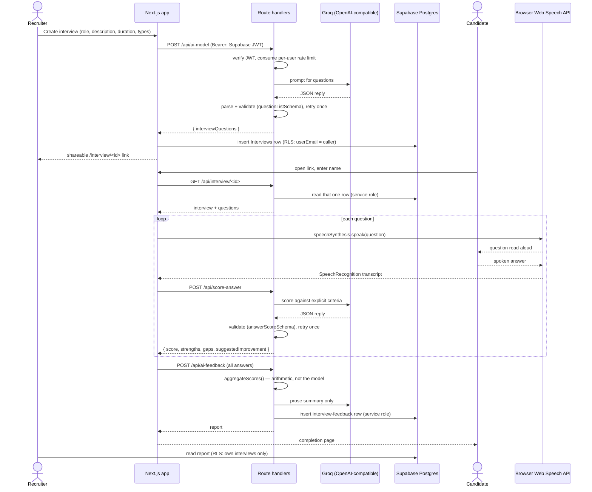

# AI Interview Platform

A web app where a recruiter generates a role-specific interview with a language model, shares a link, and the candidate answers out loud in the browser — each answer scored individually and collected into a report.

## Screenshots

| | |
|---|---|
|  |  |
| Landing page | Recruiter dashboard |
|  |  |
| Interview creation | Credit purchase |

## How it works

A signed-in recruiter fills in the role, description, duration and interview types on `/dashboard/create-interview`; `QuestionList.jsx` posts that to `app/api/ai-model/route.js` with the Supabase session JWT in an `Authorization` header, and the route verifies the token, spends one unit of that user's hourly rate limit, calls the model, and validates the reply against `questionListSchema` before returning it — a malformed reply is retried once and then refused rather than shown. The questions are stored in the `Interviews` table under the recruiter's email and turned into a `/interview/<uuid>` link.

A candidate opening that link is not signed in, so `app/interview/[interview_id]/page.jsx` reads the interview through `app/api/interview/[interview_id]/route.js` instead of querying Supabase directly — row level security denies anonymous reads of the table, and the route hands back exactly the one row the link names. The session itself (`app/interview/[interview_id]/start/`) uses the browser's own Web Speech API: `speechSynthesis` reads each question aloud and `SpeechRecognition` captures the spoken answer, both wired up in `hooks/useSpeech.js`. There is no voice vendor and no key in the client.

Each answer is posted to `app/api/score-answer/route.js`, which scores it 0–10 against explicit criteria and returns a `{ score, strengths, gaps, suggestedImprovement }` object validated by `answerScoreSchema`. When the last question is done, `app/api/ai-feedback/route.js` computes the rating breakdown arithmetically from those per-answer scores (`lib/score.js`) — the model is asked only for the prose summary — and writes the report to `interview-feedback`. The recruiter reads it back on `/scheduled-interview/<id>/details`, where row level security limits them to their own interviews.

Every branch of the live session — no speech recognition in this browser, microphone blocked, recognition error, candidate silent, scoring endpoint down — is a transition in the pure reducer at `lib/interviewMachine.js`, which is why there is no state in which the page shows a spinner with no way forward.



## Setup

### Prerequisites

- Node.js 24 and npm 11 (built and tested on these; Node 18+ should work)
- A Supabase project — free tier, no card
- A Groq API key — free tier, no card
- Optionally a PayPal sandbox client id, only if you want the billing page to work

Everything the app depends on has a free tier. There is nothing to pay for.

### Install

```bash
git clone https://github.com/vipinsao/ai-interview-platform.git
cd ai-interview-platform
npm install
```

### Environment

```bash
cp .env.example .env.local
```

Fill in every variable. `.env.example` says where each one comes from. The app throws on startup naming anything that is missing, rather than failing later inside a client library.

`SUPABASE_SERVICE_ROLE_KEY` is server-only. It bypasses row level security, so it must never be given a `NEXT_PUBLIC_` prefix.

### Supabase

1. Create a project at [supabase.com](https://supabase.com).
2. Open the SQL editor and run [`supabase/schema.sql`](./supabase/schema.sql). It creates the four tables (`Users`, `Interviews`, `interview-feedback`, `rate_limits`) and enables row level security with the ownership policies.
3. Under Authentication → Providers, enable Google and paste in a client id and secret from the [Google Cloud console](https://console.cloud.google.com). Add `http://localhost:3000` and your deployed origin to the redirect allow-list.

Note on `supabase/schema.sql`: the tables were originally created through the Supabase dashboard, so that file is reconstructed from the queries the application makes rather than copied from an original migration. It is accurate enough to stand up a fresh project, but diff it against an existing one before running it.

### Run

```bash
npm run dev     # http://localhost:3000
npm test        # unit tests (node:test, no runner dependency)
npm run lint
npm run build
```

`npm run build` prerenders pages that construct the Supabase browser client, so `NEXT_PUBLIC_SUPABASE_URL` and `NEXT_PUBLIC_SUPABASE_ANON_KEY` must be present for it to complete. CI passes syntactically valid placeholders for this; no network call is made during the build.

## Tech stack

Only what is actually in `package.json`:

- **Next.js 15.3** (App Router) and **React 18** — pages and API route handlers in one deployment
- **JavaScript**, not TypeScript — the project has a `jsconfig.json` and no `tsconfig.json`
- **Tailwind CSS v4** with Radix UI primitives (shadcn/ui "new-york" style) and **lucide-react** icons
- **Supabase** (`@supabase/supabase-js`) — Postgres, Google OAuth, row level security
- **openai** SDK pointed at **Groq**'s OpenAI-compatible endpoint
- **zod** — validation of every model reply and every API request body
- **Web Speech API** — browser built-in, no dependency
- **@paypal/react-paypal-js** — credit purchase buttons
- **sonner**, **react-hot-toast**, **moment**, **uuid**
- **ESLint 9** with `eslint-config-next`; tests run on the built-in `node:test` runner

## Notes and limitations

**Speech recognition is not available in every browser.** It works in Chrome and other Chromium browsers (Edge, Opera) and in Safari 14.1+ on macOS / 14.5+ on iOS, in all cases behind the `webkitSpeechRecognition` prefix. Firefox does not implement it at all. The app detects this at runtime and falls back to typed answers, so the interview still works everywhere — but a Firefox user types.

**Speech recognition is not private and not offline.** In Chrome, audio is streamed to Google's speech service for transcription. Nothing is recognised locally, and the feature does not work without a network connection.

**Free LLM tiers may train on what you send them.** Fine for a portfolio project; worth knowing before putting a real candidate's answers through it.

**Rate limiting is not atomic.** The counter is read, evaluated and written back as separate statements, so two requests arriving in the same instant can both be admitted. At roughly one request per spoken answer this is not worth a lock; the fix would be a Postgres function doing the increment in a single statement.

**Scoring is a language model's judgement, not a measurement.** The same answer can score differently on different runs. Only the aggregate arithmetic is deterministic — the per-answer scores are not. There is no accuracy figure for it because none has been measured.

**Interview sessions do not survive a page refresh.** The candidate's name and questions live in React context, so a refresh mid-interview ends the session; the page says so and links back rather than hanging.

**The billing page does not verify payments.** PayPal approval adds credits straight from the browser, with no server-side capture or verification, so the credit balance is not trustworthy. Treat it as a UI demonstration.

**There is no deployed instance linked here.** An earlier build was deployed to Vercel, but it runs the pre-rewrite code and its question generation is broken — the free OpenRouter model it called (`microsoft/mai-ds-r1:free`) has been retired and the endpoint now returns a 404 from upstream. Redeploy from this branch before linking a demo.

**Two toast libraries are in use** (`sonner` and `react-hot-toast`) for historical reasons. One should go.

See [DECISIONS.md](./DECISIONS.md) for why the voice provider, the scoring format and the rate limiter are built the way they are.

## License

[MIT](./LICENSE)
